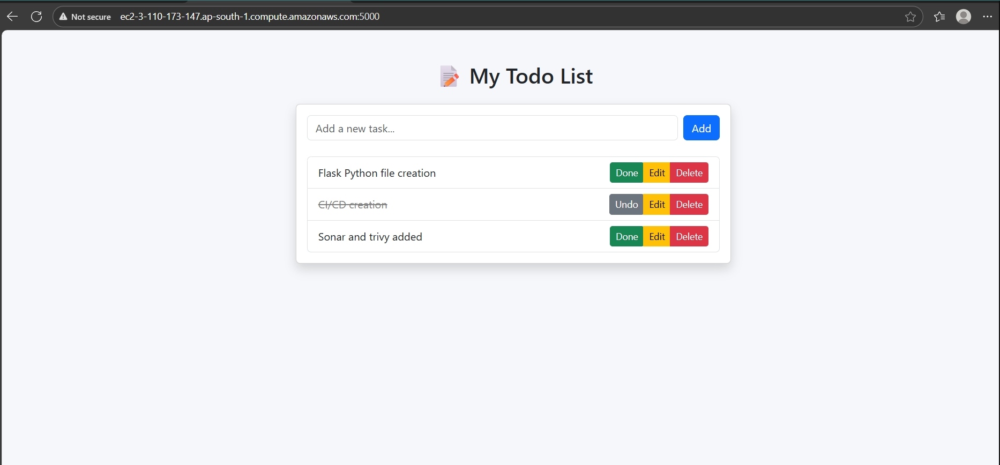
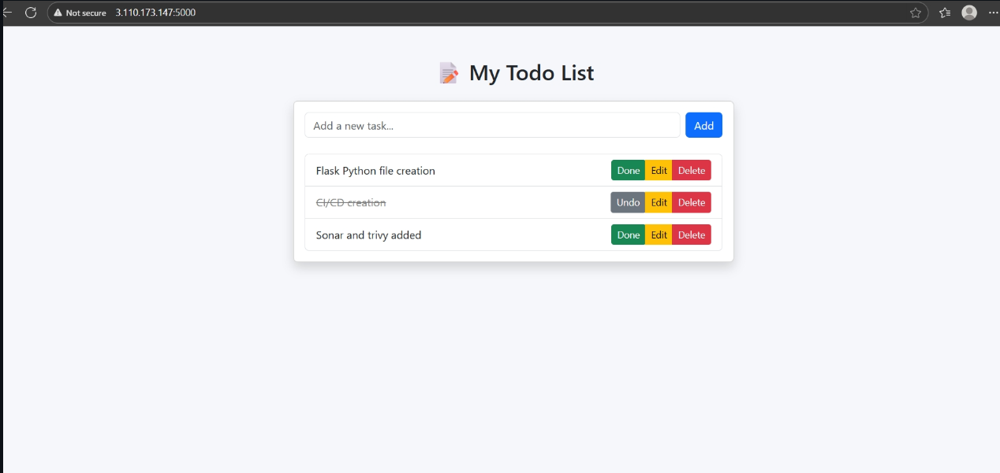

# ✅ Flask Todo App — DevOps Project

A complete end-to-end DevOps project demonstrating:

- A **Flask-based Todo App**
- **Infrastructure as Code** using Terraform
- **CI/CD with GitHub Actions** (self-hosted runner on EC2)
- **Containerization** using Docker
- **Static code analysis** with SonarQube
- **Image vulnerability scanning** using Trivy
- **Secure deployment** to AWS EC2 from ECR

---

## 📸 Screenshot

Flask ToDo app on both Public IP and Public DNS of EC2:




---

## 🚀 Tech Stack

| Layer         | Tool/Service                           |
|---------------|----------------------------------------|
| Frontend      | HTML, Jinja2 (via Flask templates)     |
| Backend       | Flask (Python)                         |
| Container     | Docker                                 |
| IaC           | Terraform                              |
| CI/CD         | GitHub Actions (self-hosted EC2 runner)|
| Security Scan | SonarQube, Trivy                       |
| Cloud Infra   | AWS (EC2, ECR, VPC, S3, IAM)           |

---

## 🧱 Architecture Overview

```text
GitHub Repo (main branch)
     |
     | GitHub Actions (on push)
     |   ↳ Checkout
     |   ↳ SonarQube Scan (optional)
     |   ↳ Trivy Scan
     |   ↳ Build Docker Image
     |   ↳ Push to Amazon ECR
     |   ↳ Deploy to EC2 (via Docker)
     |
📦 Terraform Resource Creation
Terraform creates the following AWS resources:

VPC, Public Subnet, Internet Gateway, Route Table

Security Groups

EC2 Instance

ECR Repository

S3 Bucket

IAM User

🏃 Self-Hosted GitHub Runner Setup (on EC2)
Install GitHub Actions runner and AWS CLI in your EC2 instance:

bash
Copy
Edit
# Update packages
sudo apt update

# Install required tools
sudo apt install -y unzip curl

# Create a folder
mkdir actions-runner && cd actions-runner

# Download the latest runner package
curl -o actions-runner-linux-x64-2.327.1.tar.gz -L https://github.com/actions/runner/releases/download/v2.327.1/actions-runner-linux-x64-2.327.1.tar.gz

# Extract the installer
tar xzf ./actions-runner-linux-x64-2.327.1.tar.gz

# Configure the runner
./config.sh --url https://github.com/<your-username>/Todo-Flask-App --token <your_token> --labels self-hosted

# Install and start the service
sudo ./svc.sh install
sudo ./svc.sh start

# Install AWS CLI
curl "https://awscli.amazonaws.com/awscli-exe-linux-x86_64.zip" -o "awscliv2.zip"
unzip awscliv2.zip
sudo ./aws/install
🔐 GitHub Secrets Configuration
Set the following secrets in your GitHub repository:

Name	Description
AWS_ACCESS_KEY_ID	IAM user’s access key
AWS_SECRET_ACCESS_KEY	IAM user’s secret key
ECR_REGISTRY	ECR URL (<aws_id>.dkr.ecr.region.amazonaws.com)
SONAR_TOKEN	Token from SonarQube
SONAR_HOST_URL	SonarQube server URL (http://localhost or a public URL)

📌 Notes
The runner pulls Docker images from Amazon ECR and runs them on EC2.

SonarQube and Trivy scans are triggered from within GitHub Actions.

Ensure IAM roles have required permissions for ECR and EC2 operations.

